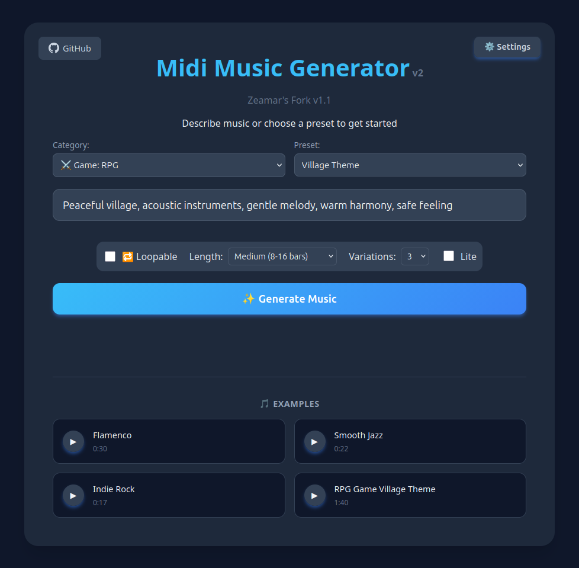
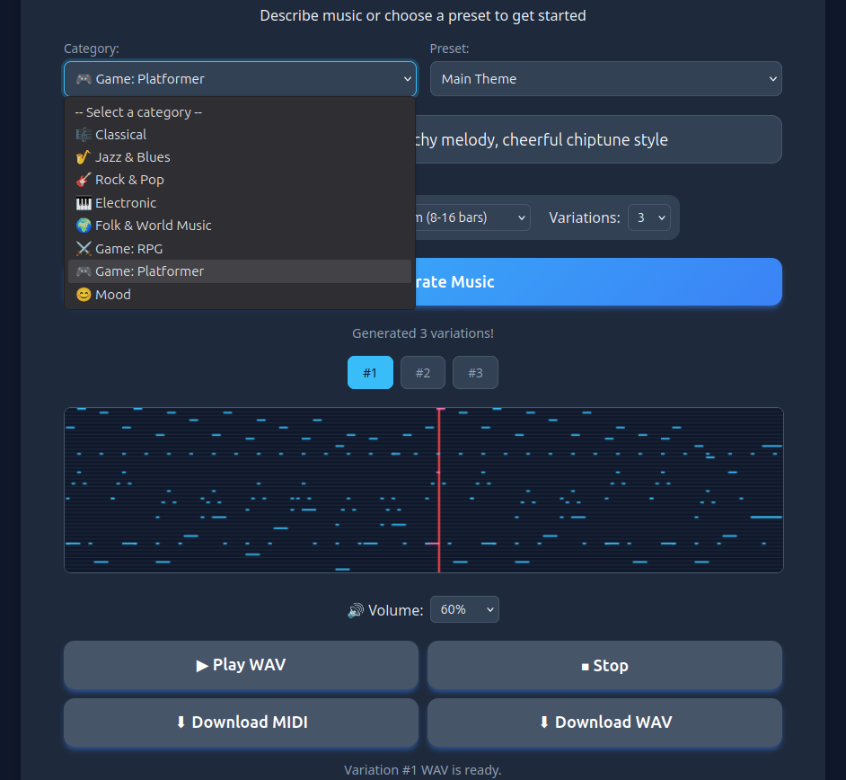

# MIDI Music Generator (Fork)

An AI music generator that creates MIDI compositions from text prompts using LLMs.

This is a fork of [addy999/midi-music-generator](https://github.com/addy999/midi-music-generator) with the following changes:

- **Preset system** — The original 12 hardcoded preset buttons have been replaced with a hierarchical two-dropdown menu (category → preset) powered by an external `presets.json` file. Includes 35 ready-made presets across multiple categories.
- **Additional LLM providers** — Added Gemini (Direct API) and Ollama (Local) as built-in provider options alongside the originals.
- **Preset Editor** — An optional companion tool for creating and managing presets via a browser-based GUI.
- **Bug fixes and UI improvements** — See [CHANGELOG.md](CHANGELOG.md) for details.

## Screenshots





## Features

- 🎵 Generate MIDI music from natural language descriptions
- 🔄 Loop mode for seamless repeating tracks
- 🎹 Supports all General MIDI instruments (0-127)
- 🎼 Multi-track compositions
- 🔊 MIDI to WAV conversion with FluidSynth
- 🤖 Works with multiple LLM providers (Gemini, OpenAI, Anthropic, Ollama)

## Setup

> **Note:** These instructions are written for Linux (tested on Linux Mint / Ubuntu). The application may work on other platforms, but the commands below (especially `apt install`, `source venv/bin/activate`) are Linux-specific.

### Requirements

- Python 3.10+
- [FluidSynth](https://www.fluidsynth.org/) with a General MIDI soundfont (required for MIDI → WAV conversion)

### Installation

```bash
git clone https://github.com/Zeamar/midi-music-generator.git
cd midi-music-generator
python3 -m venv venv
source venv/bin/activate
pip3 install flask litellm midiutil
```

#### FluidSynth and soundfonts

FluidSynth is needed for converting generated MIDI files to playable WAV audio. Without it, you can still generate and download MIDI files.

On Debian/Ubuntu/Mint:
```bash
sudo apt install fluidsynth fluid-soundfont-gm
```

The app automatically detects soundfont files — it first checks the project directory for known soundfont filenames, then checks common system paths (`/usr/share/sounds/sf2/`, `/usr/share/sounds/sf3/`, etc.). If you have FluidSynth installed with its default soundfonts, it should work out of the box.

If you want to use a specific soundfont (e.g. [GeneralUser GS](https://schristiancollins.com/generaluser.php) for higher quality), place the `.sf2` file in the project root. Check that the filename matches what the code expects in the `find_soundfont()` function in `app.py`, or rename the file accordingly.

### Running

```bash
cd midi-music-generator
source venv/bin/activate
python3 app.py
```

Open your browser to `http://localhost:5001`

### Docker

The original project includes a Docker setup. If you prefer Docker, see the [original repository](https://github.com/addy999/midi-music-generator) for instructions. Note that the Docker image may not include the changes in this fork.

## Usage

1. Enter your API key in the settings
2. Select a preset from the dropdown menus, or type your own description
3. Click "Generate" to create your MIDI file
4. Listen to the result or download the generated MIDI/WAV file

### LLM Provider Options

The settings menu offers the following provider options:

- **Gemini** — Uses litellm's native Gemini routing.
- **Gemini (Direct API)** — Connects directly to Google's REST endpoint. Use this if the standard Gemini option doesn't work with your API key.
- **OpenAI** — For OpenAI API keys (GPT-4, etc.).
- **Anthropic** — For Anthropic API keys (Claude models).
- **Ollama (Local)** — For local models via [Ollama](https://ollama.com/). No API key required. Expects Ollama running at `http://localhost:11434`. Results depend on the model's ability to follow structured output instructions — larger models tend to work better.
- **Custom** — Lets you specify any OpenAI-compatible API endpoint and model name.

> **Tip:** Not sure which Gemini model to use? The included `list_gemini_models.py` utility lists all models available with your API key. See [README_List_Gemini_Models.md](README_List_Gemini_Models.md) for details.

## Preset Editor (Optional)

A separate browser-based tool for adding, editing, and organizing presets. Not required for normal use — the app comes with 35 presets and you can always type a custom prompt.

See [README_Preset_editor.md](README_Preset_editor.md) for setup and usage instructions.

## License

MIT
