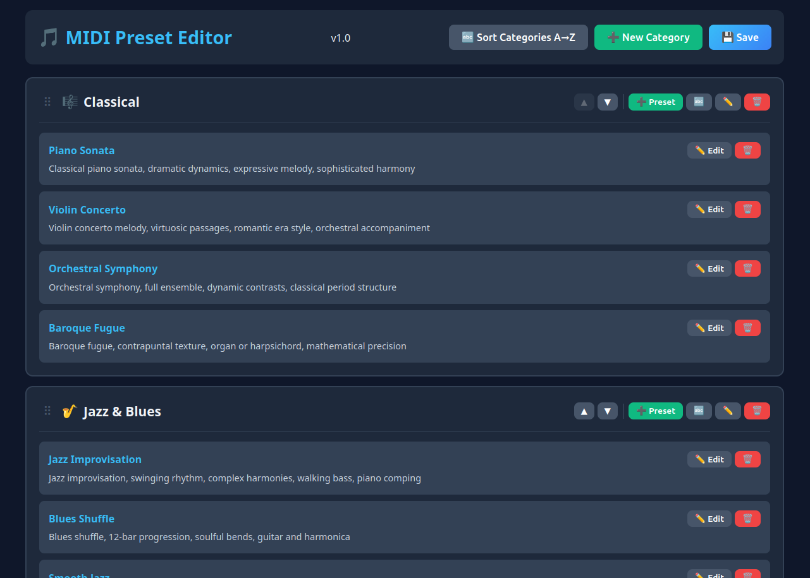

# MIDI Preset Editor

A simple editor for managing the `presets.json` file used by the MIDI Music Generator.

The Preset Editor is included in the repository and shares the same dependencies (Flask) as the main app — no additional installation is needed.



## Usage

### Installation

```bash
cd midi-music-generator
source venv/bin/activate
python3 preset_editor.py
```

Open your browser to `http://localhost:5002`

### Editing presets

- ➕ New category — Add a new category
- ✏️ — Edit a category or preset
- 🗑️ — Delete a category or preset (asks for confirmation)
- 💾 Save — Save changes to file


## Features

✅ Automatically loads `presets.json` on startup
✅ Add, edit, and delete categories
✅ Add, edit, and delete presets
✅ Sort presets alphabetically within a category (🔤 button)
✅ Sort all categories alphabetically (🔤 Sort Categories A→Z)
✅ Emoji picker for categories
✅ Automatic backup before saving
✅ Confirmation dialogs for delete operations
✅ JSON validation

## Safety

- **No auto-save** — changes are only written to disk when you click "Save"
- **Backups** — every save creates a timestamped backup copy (e.g. `presets_backup_20261214_153045.json`)
- **Confirmations** — deleting categories or presets requires explicit confirmation

## Notes

- The editor **does not require** the main application to be running
- It uses a different port (5002) from the main app (5001), so both can run simultaneously
- Changes made in the editor will appear in the main app after a page refresh (F5)

## Troubleshooting

**"Address already in use"**
Port 5002 is occupied by another process. Change the port at the bottom of `preset_editor.py`:
```python
app.run(host='0.0.0.0', port=5003, debug=False)
```

**`presets.json` not found**
Make sure you run the editor from the same directory where `presets.json` is located. If the file does not exist, it will be created automatically.

**Changes not showing in the main app**
Refresh the main app page (F5). The main app reloads presets on every page load.

## License

MIT
